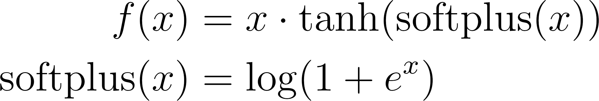
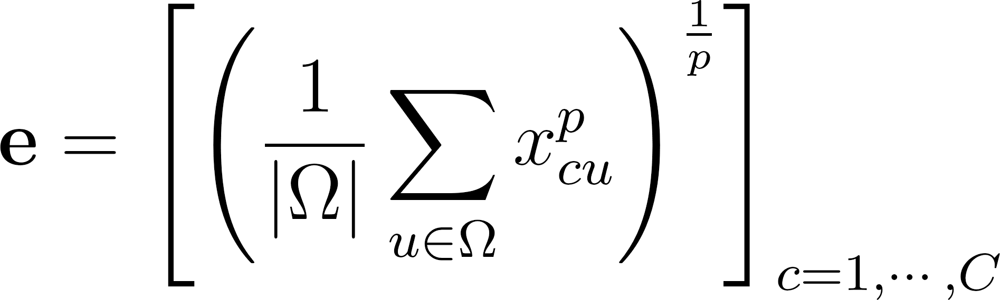
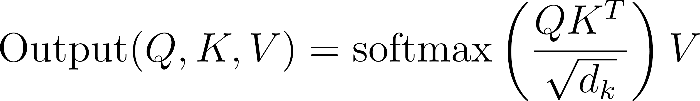
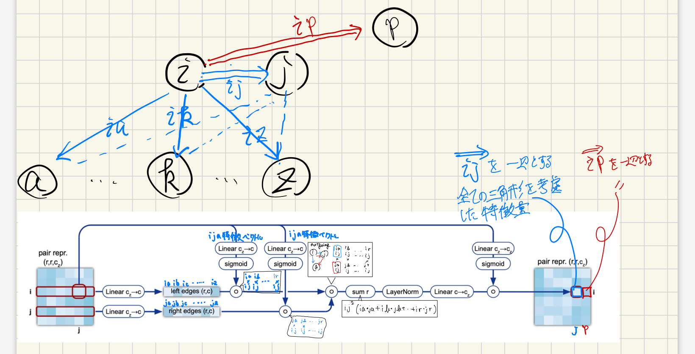
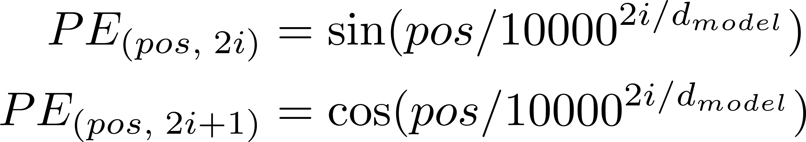
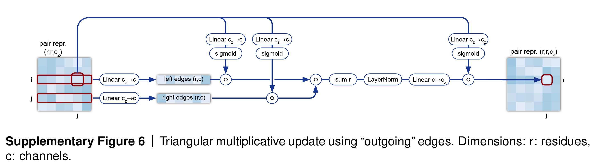

# 岩本の作業ログ

## 2025/04/06

### [host の Discussion](https://www.kaggle.com/competitions/stanford-rna-3d-folding/discussion/565064) を見て

ホストの言う戦略

- [RibonanzaNet](https://www.biorxiv.org/content/10.1101/2024.02.24.581671v2)を Fine-tune する。
- マルチプルアラインメントの情報を使う。
- 文献知識の活用。
- 複数の構造を持つ RNA を考慮する。
  この時、seed の違いで異なる構造を得ることは考えない。
- 仮の構造を生成し、こそから更に推論を行う。
- 合成 RNA の構造を augmentation に用いる。

### [RibonanzaNet Fine-tune の Discussion](https://www.kaggle.com/competitions/stanford-rna-3d-folding/discussion/565306) を見て

#### Fine-tune の loss

0. `calculate_distance_matrix`関数

    **1 つの構造の中の**各塩基同士の距離を計算

    <details>
    <summary>実装</summary>

    ```python
    def calculate_distance_matrix(X,Y,epsilon=1e-4):
        # X[:,None]はXの各残基を行ベクトルに、Y[None,:]はYの各残基を列ベクトルに変換したもの
        # X[:,None]-Y[None,:]はXの各残基とYの各残基の距離を計算した len(X) x len(Y) 行列
        return (torch.square(X[:,None]-Y[None,:])+epsilon).sum(-1).sqrt()
    ```

    </details>

1. `dRMSD` (Root Mean Square Deviation)

    **通常、`pred_x`と`pred_y`, `gt_x`と`gt_y`は同じ構造を持つ。**

    <details>
    <summary>実装</summary>

    ```python
    def dRMSD(pred_x, pred_y, gt_x, gt_y, epsilon=1e-4,Z=10,d_clamp=None):
        '''
        pred_x: 予測された構造
        pred_y: 予測された構造
        gt_x: 実際の構造
        gt_y: 実際の構造
        '''

        # pred_xとpred_yの各残基の座標を使って距離行列を計算
        pred_dm=calculate_distance_matrix(pred_x,pred_y)
        # gt_xとgt_yの各残基の座標を使って距離行列を計算
        gt_dm=calculate_distance_matrix(gt_x,gt_y)

        # gt_dmのNaNを除外するマスクを作成
        mask=~torch.isnan(gt_dm)
        # 対角成分(自分自身との距離)を除外するマスクを作成
        mask[torch.eye(mask.shape[0]).bool()]=False

        # d_clampが指定されている場合、距離の差をd_clampでクリップする
        if d_clamp is not None:
            # pred_dmとgt_dmの距離の差を計算
            # clipで指定された範囲 (0 <= loss <= d_clamp**2) に収める
            rmsd=(torch.square(pred_dm[mask]-gt_dm[mask])+epsilon).clip(0,d_clamp**2)
        else:
            rmsd=torch.square(pred_dm[mask]-gt_dm[mask])+epsilon

        return rmsd.sqrt().mean()/Z
    ```

    </details>

2. `local_dRMSD` (Local Root Mean Square Deviation)

    `dRMSD`とは mask の作り方が異なり、**d_clamp より大きい距離は loss の計算から除外される**。

    <details>
    <summary>実装</summary>

    ```python
    def local_dRMSD(pred_x, pred_y, gt_x, gt_y, epsilon=1e-4,Z=10,d_clamp=30):
        # 上と同じ
        pred_dm=calculate_distance_matrix(pred_x,pred_y)
        gt_dm=calculate_distance_matrix(gt_x,gt_y)

        # gt_dmがNaN　+ dt_dmがd_clamp以上の距離を除外するマスクを作成
        mask=(~torch.isnan(gt_dm)) * (gt_dm < d_clamp)
        mask[torch.eye(mask.shape[0]).bool()]=False

        rmsd=torch.square(pred_dm[mask]-gt_dm[mask])+epsilon

        return rmsd.sqrt().mean()/Z
    ```

    </details>

3. `dMAE` (Mean Absolute Error)
    <details>
    <summary>実装</summary>

    ```python
    def dMAE(pred_x, pred_y, gt_x, gt_y, epsilon=1e-4,Z=10,d_clamp=None):
        pred_dm=calculate_distance_matrix(pred_x,pred_y)
        gt_dm=calculate_distance_matrix(gt_x,gt_y)

        mask=~torch.isnan(gt_dm)
        mask[torch.eye(mask.shape[0]).bool()]=False

        # dRMSDでは2乗していたが、dRMAEでは絶対値を取る
        # d_clampの処理をしないのは2乗しないため大きい値を取らないから?
        rmsd=torch.abs(pred_dm[mask]-gt_dm[mask])

        # rootも取らない
        return rmsd.mean()/Z
    ```

    </details>

    > [!NOTE]
    > notebook には`dRMAE`と書いてあるが、実装では root を取っていないので`dMAE`の誤植と思われる。

1. `align_svd_mae`

    特異値分解を用いて、2 つの構造のアライメントを行い、MAE loss を計算する。

    <details>
    <summary>実装</summary>

    ```python
    def align_svd_mae(input, target, Z=10):

        assert input.shape == target.shape, "Input and target must have the same shape"

        # sum(-1)で各塩基の座標を足し合わせて、NaNを含む行(塩基)を除外するマスクを作成
        mask=~torch.isnan(target.sum(-1))

        input=input[mask]
        target=target[mask]

        # x, y, zの座標を持つ点群の重心を計算
        # 結果として1x3のテンソル(x, y, zの平均を持つ)が得られる
        centroid_input = input.mean(dim=0, keepdim=True)
        centroid_target = target.mean(dim=0, keepdim=True)

        # 各塩基の座標から重心を引いて、中心化する (重心を原点に移動)
        # detach()は重心に関して、勾配の計算を行わないようにするため (誤差逆伝播の計算を行わない)
        input_centered = input - centroid_input.detach()
        target_centered = target - centroid_target

        # Procrustes analysis
        # 2つのdatasetが最もマッチするような回転を求める
        cov_matrix = input_centered.T @ target_centered

        # SVD to find optimal rotation
        U, S, Vt = torch.svd(cov_matrix)

        # Compute rotation matrix
        R = Vt @ U.T

        # torch.det(R)が負の場合、回転ではなく反転が起こっているので、det(R)を正にするためにVtの最後の行を反転させる
        if torch.det(R) < 0:
            Vt[-1, :] *= -1
            R = Vt @ U.T

        # Rotate input
        aligned_input = (input_centered @ R.T.detach()) + centroid_target.detach()

        # Calculate MAE loss
        return torch.abs(aligned_input-target).mean()/Z
    ```

    </details>

#### Fine-tune の train

- optimizer

  - Adam
  - param: `learning rate`: 1e-4
  - param: `weight decay`: 0.0 \
     L2 正則化なし \
     Alfa Fold に従っている

- scheduler

  - CosineAnnealingLR \
     学習率をコサイン関数に従って減少させる。 \
     `cos_epoch`で指定した epoch 数から徐々に減少させる。

    <details>
    <summary>param: T_max</summary>

    `iteration`の最大値である。つまり、**学習率が 0 に達する epoch 数**であり、以下のように指定されている。 \
    `(epoch - cos_epoch) * len(train_loader) // batch_size`

    - `epoch - cos_epoch` \
        `全体のepoch数 - cosineAnnealingを開始するepoch`であり、学習率を減少させる epoch 数を表す。
    - `len(train_loader) // batch_size` \
        `train_loader`の長さを`batch_size`で割った値であり、1 epoch あたりのイテレーション数を表す。 \
        つまり、1 epoch あたりのイテレーション数は、`train_loader`の長さを`batch_size`で割った値である。

    **epoch 数 \* 1 epoch の iteration 数 = cosineAnnealing を適用する iteration 数**が`T_max`となる。

    </details>

> [!NOTE]
> ChatGPT によると、`len(train_loader)`自体が iteration 数を表すので、`batch_size`で割る必要はないとのこと。 \
> 真偽のほどは不明。

## 2025/04/07

### [RibonanzaNet Fine-tune の Discussion](https://www.kaggle.com/competitions/stanford-rna-3d-folding/discussion/565306) を見て (続き)

#### Fine-tune の train (続き)

<details>
<summary>実装</summary>

```python
scaler = GradScaler()

for epoch in range(epochs):
    model.train()
    # progress bar
    tbar=tqdm(train_loader)
    total_loss=0
    # out of memory
    oom=0

    for idx, batch in enumerate(tbar):
        try:
            # sequenceをGPUに転送
            sequence=batch['sequence'].cuda()
            # 'xyz'をGPUに転送し、次元の削減 (モデルの出力と同じ次元にするため)
            gt_xyz=batch['xyz'].cuda().squeeze()

            #with torch.autocast(device_type='cuda', dtype=torch.float16):
            # sequenceをモデルに入力して、予測された座標を取得し、次元を削減
            pred_xyz=model(sequence).squeeze()

            # lossの計算
            loss=dRMAE(pred_xyz,pred_xyz,gt_xyz,gt_xyz) + align_svd_mae(pred_xyz, gt_xyz)
                #local_dRMSD(pred_xyz,pred_xyz,gt_xyz,gt_xyz)

            # NaNのcheck (NaNは自分自身と等しくない)
            if loss!=loss:
                stop

            (loss/batch_size).backward()

            if (idx+1)%batch_size==0 or idx+1 == len(tbar):
                # 勾配のnormのclip
                torch.nn.utils.clip_grad_norm_(model.parameters(), 1)
                # parameterの更新
                optimizer.step()
                # 勾配の初期化
                optimizer.zero_grad()

                # 自動混合精度(AMP)を使用する場合のコード (float16に精度を落として計算する)
                # ------------------------------------------------
                # scaler.scale(loss/batch_size).backward()
                # scaler.unscale_(optimizer)
                # torch.nn.utils.clip_grad_norm_(model.parameters(), 1)
                # scaler.step(optimizer)
                # scaler.update()
                # ------------------------------------------------

                # epoch > cos_epoch の場合、学習率を減少させる
                if (epoch+1)>cos_epoch:
                    schedule.step()
            #schedule.step()
            total_loss+=loss.item()

            # progress barの更新
            tbar.set_description(f"Epoch {epoch + 1} Loss: {total_loss/(idx+1)} OOMs: {oom}")

        except Exception:
            print(Exception)
            oom+=1

    tbar=tqdm(val_loader)
    # modelをvalidationモードに設定
    # 評価モードでは、ドロップアウトやバッチ正規化が無効になる
    model.eval()
    val_preds=[]
    val_loss=0

    # validation loop
    for idx, batch in enumerate(tbar):
        sequence=batch['sequence'].cuda()
        gt_xyz=batch['xyz'].cuda().squeeze()

        # 勾配を計算しない
        with torch.no_grad():
            pred_xyz=model(sequence).squeeze()
            loss=dRMAE(pred_xyz,pred_xyz,gt_xyz,gt_xyz)

        val_loss+=loss.item()
        val_preds.append([gt_xyz.cpu().numpy(),pred_xyz.cpu().numpy()])

    val_loss=val_loss/len(tbar)
    print(f"val loss: {val_loss}")

    # best modelの保存
    if val_loss < best_val_loss:
        best_val_loss=val_loss
        best_preds=val_preds
        torch.save(model.state_dict(),'RibonanzaNet-3D.pt')

torch.save(model.state_dict(),'RibonanzaNet-3D-final.pt')
```

</details>


## 2025/04/09

### [RibonanzaNet 実装](https://github.com/Shujun-He/RibonanzaNet)を読む

#### `Network.py`

1. 活性化関数 Mish

    [原著論文](https://arxiv.org/abs/1908.08681v3) \
    式は以下の通り

    

    > [!NOTE]
    > ChatGPT曰く、「ReLU や Swish のような非線形活性化関数の一種で、滑らかで勾配消失が少なく、高速収束が期待できることから、深層学習でよく使われます。」とのこと。

    <details>
    <summary>実装</summary>

    ```python
    import torch.nn.functional as F

    class Mish(nn.Module):
        def __init__(self):
            super().__init__()

        def forward(self, x):
            # 一時変数を使用せずに、直接計算を行うと1 epochあたり 1s 短縮らしい
            return x * (torch.tanh(F.softplus(x)))
    ```

    </details>

2. Generalized Mean Pooling (GeM)

    [原著論文](https://ieeexplore.ieee.org/document/8382272) \
    [zenn](https://zenn.dev/takoroy/scraps/151d11817e3700)を見よう。

    GeMはテンソルの各チャネルの一般化平均を計算するプーリング手法で、以下の式で表される。

    

    ここで$`p > 0`$はパラメータであり、$`p > 1`$の場合は、プールされた特徴マップのコントラストが高まり、画像の顕著な特徴に焦点が当てられる。
    GeMは、分類ネットワークでよく使われる平均プーリング($`p = 1`$)と、空間最大プーリング層($`p = \infty`$)の一般化である。

    >[!NOTE]
    > 大事なのは、
    > 1. **学習可能なpooling層**であること
    > 2. pの値を調節することで、**平均プーリングと最大プーリングの中間的な動作を実現できること**
    >
    > だと思われる。

    <details>
    <summary>実装</summary>

    ```python
    import torch.nn.functional as F
    from torch.nn.parameter import Parameter

    def gem(x, p=3, eps=1e-6):
        '''
        Params:
            x: input tensor
            p: power parameter
            eps: epsilon to avoid division by zero
        '''
        # xの最小値をepsでclipしたものに対してp乗を計算
        # そのテンソルを平均プーリングして、p乗根を取る
        return F.avg_pool1d(x.clamp(min=eps).pow(p), (x.size(-1))).pow(1./p)

    class GeM(nn.Module):
        def __init__(self, p=3, eps=1e-6):
            super(GeM,self).__init__()
            # Parameterは学習可能なパラメータを定義するためのクラス
            # torch.ones(1)は1x1のテンソルを作成し、pで初期化する -> self.p = [p]となっている
            self.p = Parameter(torch.ones(1)*p)
            self.eps = eps

        def forward(self, x):
            return gem(x, p=self.p, eps=self.eps)
    ```

    </details>

3. Scaled Dot-Product Attention

    [zenn](https://zenn.dev/yuto_mo/articles/72c07b702c50df)を見よう。 \
    数式は以下の通り

    

    ここで、 $`Q`$はクエリ、$`K`$はキー、$`V`$はバリューを表す行列であり、$`d_k`$はキーの次元数を表すスカラー値である。
    $QK^T$は、クエリとキーの内積を計算することで、$`Q`$行列のベクトルと$`K`$行列のベクトルの類似度を測定する。
    考え方としてはコサイン類似度に近い。

    その後、次元が大きいほど値が大きくなるのを防ぐために、$`\sqrt{d_k}`$で割ってスケーリングを行う。

    さらに、未来の情報を参照しないようにするために、マスクをかけて、softmax関数を適用して、確率分布に変換する。
    最後に、得られた重みをバリュー行列$`V`$に掛け算して、出力を得る。
    この時、$`Q`$行列のベクトルと$`K`$行列のベクトルの類似度が高いほど、$`V`$の重みを強く反映させることができる。

    <details>
    <summary>実装</summary>

    ```python
    import torch.nn.functional as F

    class ScaledDotProductAttention(nn.Module):
        ''' Scaled Dot-Product Attention '''

        def __init__(self, temperature, attn_dropout=0.1):
            super().__init__()
            self.temperature = temperature
            self.dropout = nn.Dropout(attn_dropout)

        def forward(self, q, k, v, mask=None, attn_mask=None):
            '''
            Params:
                q: query
                k: key
                v: value
                mask: mask for padding
                attn_mask: mask for attention
            '''
            # Q·K^Tを計算
            attn = torch.matmul(q, k.transpose(2, 3))/ self.temperature

            # maskが指定されている場合、maskを加算する (pairwise feature biasの加算)
            if mask is not None:
                attn = attn + mask # this is actually the bias

            # attn_maskが指定されている場合、attn_maskを加算する (未来の情報を参照しないようにするため)
            if attn_mask is not None:
                attn = attn.float().masked_fill(attn_mask == -1, float('-1e-9'))

            # softmaxを適用して、確率分布に変換する
            # さらにdropoutを適用して、過学習を防ぐ
            attn = self.dropout(F.softmax(attn, dim=-1))

            # Q·K^Tの重みをVに掛け算して、出力を得る
            output = torch.matmul(attn, v)

            return output, attn
    ```
    </details>


4. Multi-Head Attention

    [zenn](https://zenn.dev/yuto_mo/articles/cf83d90e8dd9d4)を見よう。 \
    Scaled Dot-Product Attentionは、重みなどのパラメータを含む層が存在しないため、単純な特徴ベクトルの類似度を計算していたに過ぎない。
    そこで、Scaled Dot-Product Attentionの前に学習可能なパラメータを持つ線形層を追加することで、入力されるベクトルの特徴空間に依存しない表現力を獲得できる。
    これをSingle-Head Attentionと呼ぶ。

    > [!CAUTION]
    >
    > ここよくわからん \
    > 「入力されるベクトルの特徴空間に依存しない表現力を獲得できる」とは？ \
    > そこに依存してはいけない理由は？

    しかし、実際の言語には複数の意味を持つ単語が存在し、Single-Head Attentionでは、それらの意味を平均化してしまうため、情報が失われてしまう。

    そこで、Single-Head Attentionを複数並列に配置し、それぞれが異なる特徴空間を学習するようにすることで、情報の損失を防ぐことができる。
    これをMulti-Head Attentionと呼ぶ。

    > [!IMPORTANT]
    >
    > 確かに言語だと意味が異なる単語が存在するが、RNAの構造においてはどうなのか？ \
    > 同じ塩基でもcontextによって異なる構造を持つことがそれに当たる？
    > 構造の多様性を考慮するなら、並列の数が多いほうがいい？

    <details>
    <summary>実装</summary>

    ```python
    class MultiHeadAttention(nn.Module):
        ''' Multi-Head Attention module '''

        def __init__(self, d_model, n_head, d_k, d_v, dropout=0.1):
            '''
            Params:
                d_model: model dimension (隠れ層の次元数)
                n_head: number of heads
                d_k: dimension of key
                d_v: dimension of value
                dropout: dropout rate
            '''

            super().__init__()

            self.n_head = n_head
            self.d_k = d_k
            self.d_v = d_v

            # 線形層の定義
            # d_model次元の入力をn_head * d_k次元に変換する
            self.w_qs = nn.Linear(d_model, n_head * d_k, bias=False)
            self.w_ks = nn.Linear(d_model, n_head * d_k, bias=False)
            self.w_vs = nn.Linear(d_model, n_head * d_v, bias=False)

            # 複数のヘッドを結合するための線形層
            self.fc = nn.Linear(n_head * d_v, d_model, bias=False)

            # temperature = sqrt(d_k)でスケーリングする
            self.attention = ScaledDotProductAttention(temperature=d_k ** 0.5)

            self.dropout = nn.Dropout(dropout)
            self.layer_norm = nn.LayerNorm(d_model, eps=1e-6)


        def forward(self, q, k, v, mask=None,src_mask=None):
            '''
            params:
                q: query [batch_size, len_q, d_model]
                k: key
                v: value
                mask: mask for padding
                src_mask: mask for attention [batch_size, len_seq]
            '''

            d_k, d_v, n_head = self.d_k, self.d_v, self.n_head
            sz_b, len_q, len_k, len_v = q.size(0), q.size(1), k.size(1), v.size(1)

            residual = q

            # 線形層に通して、n_head * d_k次元に変換
            # original                       : [batch_size, len_q, d_model]
            # self.w_qs(q)                   : [batch_size, len_q, n_head * d_k]
            # .view(sz_b, len_q, n_head, d_k): [batch_size, len_q, n_head, d_k]
            q = self.w_qs(q).view(sz_b, len_q, n_head, d_k)
            k = self.w_ks(k).view(sz_b, len_k, n_head, d_k)
            v = self.w_vs(v).view(sz_b, len_v, n_head, d_v)

            # 1次元目と2次元目を入れ替える
            # [batch_size, len_q, n_head, d_k] -> [batch_size, n_head, len_q, d_k]
            # headの次元が前に来ると、(len_q, d_k)の行列をn_head個持つことになるので、並列の計算が実装しやすい
            q, k, v = q.transpose(1, 2), k.transpose(1, 2), v.transpose(1, 2)

            if src_mask is not None:
                src_mask[src_mask==0] = -1
                # [batch_size, len_seq] -> [batch_size, len_seq, 1]
                src_mask=src_mask.unsqueeze(-1).float()
                # permute: [batch_size, len_seq, 1] -> [batch_size, 1, len_seq]
                # matmul: [batch_size, len_seq, 1] x [batch_size, 1, len_seq] -> [batch_size, len_seq, len_seq]
                # unsqueeze: [batch_size, len_seq, len_seq] -> [batch_size, 1, len_seq, len_seq]
                attn_mask=torch.matmul(src_mask,src_mask.permute(0,2,1)).unsqueeze(1)
                q, attn = self.attention(q, k, v, mask=mask, attn_mask=attn_mask)
            else:
                q, attn = self.attention(q, k, v, mask=mask)

            # q: [batch_size, n_head, len_q, d_v]
            # transpose: [batch_size, n_head, len_q, d_v] -> [batch_size, len_q, n_head, d_v]
            # contiguous: メモリ上で連続したテンソルを作成する (viewに必要)
            # view: [batch_size, len_q, n_head, d_v] -> [batch_size, len_q, n_head * d_v]
            q = q.transpose(1, 2).contiguous().view(sz_b, len_q, -1)

            # 線形層に通して、n_head * d_v次元をd_model次元に変換する
            # dropoutを適用して、過学習を防ぐ
            q = self.dropout(self.fc(q))
            # 元のqを加算する (Residual Connection: 残差接続)
            q += residual

            # 次元ごとに平均0, 分散1に正規化する
            q = self.layer_norm(q)

            return q, attn
    ```
    </details>

## 2025/04/10, 11

### [RibonanzaNet 実装](https://github.com/Shujun-He/RibonanzaNet)を読む (続き)

#### `Network.py` (続き)

5. ConvTransformerEncoder Class

    Transformer + 畳み込み + Triangle Attention + Pairwise Featureを組み合わせたencode層である。

    Triangle Attentionとは、pairwise featureに対して、3つの異なる塩基の三角形的な関係を考慮したattention機構である。
    

    <details>
    <summary>実装</summary>

    ```python
    class ConvTransformerEncoderLayer(nn.Module):

        def __init__(self, d_model, nhead, dim_feedforward, pairwise_dimension, use_triangular_attention, dropout=0.1, k=3):
            '''
            Params:
                d_model: model dimension
                nhead: number of heads
                dim_feedforward: feed forwardの隠れ層の次元数
                pairwise_dimension: pairwise featureの次元数
                use_triangular_attention: boolean
                dropout: dropout rate
                k: 畳み込みのカーネルサイズ
            '''

            super(ConvTransformerEncoderLayer, self).__init__()

            # multi-head attentionの定義
            self.self_attn = MultiHeadAttention(d_model, nhead, d_model//nhead, d_model//nhead, dropout=dropout)

            # feed forwardの入力層->隠れ層
            self.linear1 = nn.Linear(d_model, dim_feedforward)
            # feed forwardの隠れ層の活性化関数後のdropout
            self.dropout = nn.Dropout(dropout)
            # feed forwardの隠れ層->出力層
            self.linear2 = nn.Linear(dim_feedforward, d_model)

            # 畳み込み後 + multi-head attentionの正規化
            self.norm1 = nn.LayerNorm(d_model)
            # feed forwardの残差接続後の正規化
            self.norm2 = nn.LayerNorm(d_model)
            # 畳み込み層の正規化
            self.norm3 = nn.LayerNorm(d_model)

            # multi-head attentionの計算結果のdropout
            self.dropout1 = nn.Dropout(dropout)
            # feed forwardの計算結果のdropout
            self.dropout2 = nn.Dropout(dropout)

            # multi-head attentionにpairwise representationを加えるための線形層
            self.pairwise2heads = nn.Linear(pairwise_dimension,nhead,bias=False)
            self.pairwise_norm = nn.LayerNorm(pairwise_dimension)
            self.activation = nn.GELU()

            # sequenceの畳み込み
            self.conv = nn.Conv1d(d_model, d_model, k, padding=k//2)

            # outgoingとingoingの Triangular multiplicative updateを計算する層
            self.triangle_update_out = TriangleMultiplicativeModule(dim=pairwise_dimension,mix='outgoing')
            self.triangle_update_in = TriangleMultiplicativeModule(dim=pairwise_dimension,mix='ingoing')

            # triangular multiplicative updateのdropout
            self.pair_dropout_out = DropoutRowwise(dropout)
            self.pair_dropout_in = DropoutRowwise(dropout)

            self.use_triangular_attention = use_triangular_attention
            if self.use_triangular_attention:
                # outgoingの triangle attentionを計算する層
                self.triangle_attention_out = TriangleAttention(in_dim=pairwise_dimension,
                                                                        dim=pairwise_dimension//4,
                                                                        wise='row')
                # incomingの triangle attentionを計算する層
                self.triangle_attention_in = TriangleAttention(in_dim=pairwise_dimension,
                                                                        dim=pairwise_dimension//4,
                                                                        wise='col')

                # triangular attentionのdropout
                self.pair_attention_dropout_out = DropoutRowwise(dropout)
                self.pair_attention_dropout_in = DropoutColumnwise(dropout)

            # pairwise_featuresに加算するsequence representationsのouter_product_meanを計算する層
            self.outer_product_mean = Outer_Product_Mean(in_dim=d_model, pairwise_dim=pairwise_dimension)

            # transitionを適用する層
            self.pair_transition = nn.Sequential(
                                            nn.LayerNorm(pairwise_dimension),
                                            nn.Linear(pairwise_dimension,pairwise_dimension*4),
                                            nn.ReLU(inplace=True),
                                            nn.Linear(pairwise_dimension*4,pairwise_dimension))


        def forward(self, src , pairwise_features, src_mask=None, return_aw=False):
            '''
            Params:
                src: input sequence [batch_size, len_seq, d_model]
                pairwise_features: pairwise features [batch_size, len_seq, len_seq, pairwise_dimension]
                src_mask: mask for padding
                return_aw: return attention weights
            '''

            # src_maskを適用する
            src = src * src_mask.float().unsqueeze(-1)

            # 畳み込みを適用する
            # len_seqの次元を畳み込みたいので、一度[batch_size, d_model, len_seq]に変換して戻している
            src = src + self.conv(src.permute(0,2,1)).permute(0,2,1)
            # srcを正規化する
            src = self.norm3(src)

            # pairwise_featuresを正規化したものをpairwise_biasに変換する
            # pairwise_bias: [batch_size, n_head, len_seq, len_seq]
            pairwise_bias=self.pairwise2heads(self.pairwise_norm(pairwise_features)).permute(0,3,1,2)

            # multi-head attentionを適用する
            src2, attention_weights = self.self_attn(src, src, src, mask=pairwise_bias, src_mask=src_mask)

            # multi-head attentionの結果を元のsrcに加算する (Residual Connection: 残差接続)
            src = src + self.dropout1(src2)
            # srcを正規化する
            src = self.norm1(src)
            # feed forwardの計算
            # 線形層 -> 活性化関数 -> dropout -> 線形層
            src2 = self.linear2(self.dropout(self.activation(self.linear1(src))))
            # 元のsrcに加算する (Residual Connection: 残差接続)
            src = src + self.dropout2(src2)
            # srcを正規化する
            src = self.norm2(src)

            # pairwise_featuresに加算するsequence representationsのouter_product_meanを計算
            pairwise_features = pairwise_features + self.outer_product_mean(src)
            # outgoing, incomingの triangular multiplicative updateを計算する
            pairwise_features = pairwise_features + self.pair_dropout_out(self.triangle_update_out(pairwise_features, src_mask))
            pairwise_features = pairwise_features + self.pair_dropout_in(self.triangle_update_in(pairwise_features, src_mask))


            if self.use_triangular_attention:
                # outgoingの triangle attentionを計算する
                pairwise_features = pairwise_features + self.pair_attention_dropout_out(self.triangle_attention_out(pairwise_features,src_mask))
                pairwise_features = pairwise_features + self.pair_attention_dropout_in(self.triangle_attention_in(pairwise_features,src_mask))

            # transitionを適用する
            pairwise_features = pairwise_features + self.pair_transition(pairwise_features)

            if return_aw:
                return src, pairwise_features, attention_weights
            else:
                return src, pairwise_features
    ```

    </details>

## 2025/04/16

### [RibonanzaNet 実装](https://github.com/Shujun-He/RibonanzaNet)を読む (続き)

#### `Network.py` (続き)

6. Absolute Positional Encoding

    transformerには、再起や畳み込みのような順序を考慮した構造がないため、位置情報を持たせる必要がある。
    そこで、encoder, decoderの入力に位置情報を加えることで、順序を考慮する。
    位置情報は、以下の式で計算される。
    

    <details>
    <summary>実装</summary>

    ```python
    class PositionalEncoding(nn.Module):
        def __init__(self, d_model, dropout=0.1, max_len=200):
            super(PositionalEncoding, self).__init__()
            self.dropout = nn.Dropout(p=dropout)

            # pe: (max_len, d_model)のテンソルを作成
            pe = torch.zeros(max_len, d_model)
            # position (max_len, 1)のテンソルを作成
            position = torch.arange(0, max_len, dtype=torch.float).unsqueeze(1)
            # 2i次元の位置情報を計算する
            # e^{x * -log(10000)/d_model} = (1/10000) ^(x/d_model)
            div_term = torch.exp(torch.arange(0, d_model, 2).float() * (-math.log(10000.0) / d_model))
            # 2i次元の位置情報を計算する
            pe[:, 0::2] = torch.sin(position * div_term)
            # 2i+1次元の位置情報を計算するa
            pe[:, 1::2] = torch.cos(position * div_term)
            # peの次元を変更する (max_len, d_model) -> (1, max_len, d_model) -> (max_len, 1, d_model)
            pe = pe.unsqueeze(0).transpose(0, 1)
            # peをバッファとして登録して、学習しないようにする
            self.register_buffer('pe', pe)

        def forward(self, x):
            # x.size(0)までの位置情報を取得し、加算する
            x = x + self.pe[:x.size(0), :]
            return self.dropout(x)
    ```
    </details>

7. Outer Product Mean

    sequence representationsをpairwise featuresに加算するための層である。

    以下は[John Jumer _et al._, _Nature_, (2021).](https://www.nature.com/articles/s41586-021-03819-2)より引用([CC BY 4.0](https://creativecommons.org/licenses/by/4.0/))
    > The MSA representation updates the pair representation through an element-wise outer product that is summed over the MSA sequence dimension. In contrast to previous work30, this operation is applied within every block rather than once in the network, which enables the continuous communication from the evolving MSA representation to the pair representation.

    日本語に訳すと、
    「MSA表現は、MSAシーケンスの次元にわたって合計される要素ごとの外積を通じてペア表現を更新する。
    この演算はネットワーク内で一度ではなく、すべてのブロック内で適用されるため、進化するMSA表現からペア表現への継続的な通信が可能になる。」
    となる。

    要素ごとの外積を計算することで、ある塩基$`i`$と$`j`$の間の相互作用を考慮することができる。
    繰り返すtransformer encoder blockの中で毎回計算することで、MSA表現からペア表現への継続的な通信が可能になる。


    <details>
    <summary>実装</summary>

    ```python
    class Outer_Product_Mean(nn.Module):
        def __init__(self, in_dim=256, dim_msa=32, pairwise_dim=64):
            '''
            Params:
                in_dim: input dimension
                dim_msa: MSA dimension
                pairwise_dim: pairwise dimension
            '''
            super(Outer_Product_Mean, self).__init__()
            self.proj_down1 = nn.Linear(in_dim, dim_msa)
            self.proj_down2 = nn.Linear(dim_msa ** 2, pairwise_dim)

        def forward(self, seq_rep, pair_rep=None):
            '''
            Params:
                seq_rep: sequence representation [batch_size, len_seq, in_dim]
                pair_rep: pairwise representation [batch_size, len_seq, len_seq, pairwise_dim]
            '''

            # seq_rep [batch_size, len_seq, in_dim] -> [batch_size, len_seq, dim_msa]
            seq_rep = self.proj_down1(seq_rep)

            # seq_rep[b, i]のベクトルとseq_rep[b, j]のベクトルの外積 (クロネッカー積)を計算する
            # [batch_size, len_seq, dim_msa] -> [batch_size, len_seq, len_seq, dim_msa, dim_msa]
            outer_product = torch.einsum('bid,bjc -> bijcd', seq_rep, seq_rep)
            # outer_productを[batch_size, len_seq, len_seq, dim_msa * dim_msa]に変換する
            outer_product = rearrange(outer_product, 'b i j c d -> b i j (c d)')
            # outer_productを[batch_size, len_seq, len_seq, pairwise_dim]に変換する
            outer_product = self.proj_down2(outer_product)

            # pair_repが指定されている場合、outer_productを加算する
            if pair_rep is not None:
                outer_product = outer_product + pair_rep

            return outer_product
    ```
    </details>

8. Relative Positional Encoding

    Relative Positional Encoding(相対位置エンコーディング)は、Transformerモデルにおいて、単語やトークン同士の相対的な位置情報を考慮するための手法である。

    [John Jumer _et al._, _Nature_, (2021).](https://www.nature.com/articles/s41586-021-03819-2)の手法を踏襲している。 ([Supplementary Information](https://static-content.springer.com/esm/art%3A10.1038%2Fs41586-021-03819-2/MediaObjects/41586_2021_3819_MOESM1_ESM.pdf)にアルゴリズムの記述あり)

    以下引用([CC BY 4.0](https://creativecommons.org/licenses/by/4.0/))

    > To provide the network with information about the positions of residues in the chain, we also encode relative positional features (Algorithm 4) into the initial pair representations.
    > Specifically, for a residue pair $`i, j \in \lbrace 1 \dots N_{res} \rbrace `$ we compute the clipped relative distance within a chain, encode it as a one-hot vector, and add this vector’s linear projection to zij.
    > Since we are clipping by the maximum value 32, any larger distances within the residue chain will not be distinguished by this feature.
    > This inductive bias de-emphasizes primary sequence distances. Compared to the more traditional approach of encoding positions in the frequency space [95], this relative encoding scheme empirically allows the network to be evaluated without quality degradation on much longer sequences than it was trained on.

    具体的には、塩基対$`i, j \in \lbrace 1 \dots N_{res} \rbrace `$の相対距離を計算し、one-hotベクトルとしてエンコードし、このベクトルの線形射影を$`z_{ij}`$に加算する。
    one-hotベクトルは、相対位置を[-32, 32]の範囲にクリップしているため、クリップされた相対距離を計算する。
    (RibonanzaNetでは、最大値を8にクリップしている。)

    > [!CAUTION]
    >
    > RibonanzaNetでは1次元配列上の相対位置を取っているだけである。
    > 3次元構造を予測するうえではそれはどうなのか？
    > 2次元構造の情報をいれるならここ？

    <details>
    <summary>実装</summary>

    ```python
    class relpos(nn.Module):
        def __init__(self, dim=64):
            super(relpos, self).__init__()
            # 17は、-8から8までの整数の数
            self.linear = nn.Linear(17, dim)

        def forward(self, src):
            # 配列の長さ
            L=src.shape[1]
            # 0からL-1までの整数を生成し、1次元目に追加する
            # res_id: (1, L)
            res_id = torch.arange(L).to(src.device).unsqueeze(0)
            device = res_id.device
            # -8から8までの整数を生成する
            bin_values = torch.arange(-8, 9, device=device)
            # res_id[:, :, None]: (1, L, 1)
            # res_id[:, None, :]: (1, 1, L)
            # d: (1, L, L)
            # d[1, i, j]には、i番目の塩基とj番目の塩基の相対距離が格納される
            d = res_id[:, :, None] - res_id[:, None, :]

            # 境界値を設定する
            bdy = torch.tensor(8, device=device)
            # 設定した境界値を超えた部分をクリップする
            d = torch.minimum(torch.maximum(-bdy, d), bdy)
            # dをone-hotベクトルに変換する
            # bin_valuesに一致する要素が1、それ以外は0になる
            d_onehot = (d[..., None] == bin_values).float()

            # d_onehotの合計が1になることを確認する
            assert d_onehot.sum(dim=-1).min() == 1
            # 線形層にかける
            p = self.linear(d_onehot)
            return p
        ```
    </details>

9. Triangle Multiplicative Module

    triangle multiplicative updateを計算する層である。

    以下の図は[John Jumer _et al._, _Nature_, (2021).](https://www.nature.com/articles/s41586-021-03819-2)より引用 ([CC BY 4.0](http://creativecommons.org/licenses/by/4.0/.))
    

    <details>
    <summary>実装</summary>

    > [!CAUTION]
    >
    > 以下の実装は、上の図と異なるところがあるので注意 (理由は不明)
    > - `out_gate`の掛け算を線形層の前に適用している。 \
    > その場合、次元が合わないはずなのになぜコードが回るのか？

    ```python
    class TriangleMultiplicativeModule(nn.Module):
        def __init__(self, *, dim, hidden_dim=None, mix='ingoing'):
            super().__init__()

            # 入力のcheck
            assert mix in {'ingoing', 'outgoing'}, 'mix must be either ingoing or outgoing'

            hidden_dim = default(hidden_dim, dim)
            self.norm = nn.LayerNorm(dim)

            self.left_proj = nn.Linear(dim, hidden_dim)
            self.right_proj = nn.Linear(dim, hidden_dim)

            self.left_gate = nn.Linear(dim, hidden_dim)
            self.right_gate = nn.Linear(dim, hidden_dim)
            self.out_gate = nn.Linear(dim, hidden_dim)

            # すべてのゲートの重みを0に、バイアスを1に初期化する
            # 初期化ではこの線形層の出力は必ず1になる
            # sigmoidにかけると、すべて0.7...くらいになる。
            # 要素ごとの掛け算の段階ですべての要素を等しく0.7倍くらいにして通すgate
            for gate in (self.left_gate, self.right_gate, self.out_gate):
                nn.init.constant_(gate.weight, 0.)
                nn.init.constant_(gate.bias, 1.)

            if mix == 'outgoing':
                # x: [..., i, k, d]と y: [..., j, k, d]のk次元の内積を計算する
                # 要するに i->k, j->kのエッジの内積を計算する
                self.mix_einsum_eq = '... i k d, ... j k d -> ... i j d'
            elif mix == 'ingoing':
                # x: [..., k, i, d]と y: [..., k, j, d]のk次元の内積を計算する
                # 要するに k->i, k->jのエッジの内積を計算する
                self.mix_einsum_eq = '... k j d, ... k i d -> ... i j d'

            self.to_out_norm = nn.LayerNorm(hidden_dim)
            self.to_out = nn.Linear(hidden_dim, dim)

        def forward(self, x, src_mask=None):
            '''
            Params:
                x: input [batch_size, len_seq, dim]
                src_mask: mask for padding [batch_size, len_seq]
            '''

            # src_mask [batch_size, len_seq] -> [batch_size, len_seq, 1]
            src_mask = src_mask.unsqueeze(-1).float()
            # mask: [batch_size, len_seq, 1] * [batch_size, 1, len_seq] -> [batch_size, len_seq, len_seq]
            mask = torch.matmul(src_mask,src_mask.permute(0,2,1))

            # check if x is square
            assert x.shape[1] == x.shape[2], 'feature map must be symmetrical'

            if mask is not None:
                # mask: [batch_size, len_seq, len_seq] -> [batch_size, len_seq, len_seq, 1]
                mask = rearrange(mask, 'b i j -> b i j ()')

            # xの正規化
            x = self.norm(x)

            # xをleft_proj, right_projに通す
            left = self.left_proj(x)
            right = self.right_proj(x)

            # left, rightにmaskを適用する
            if mask is not None:
                left = left * mask
                right = right * mask

            # xに対して、left_gate, right_gate, out_gateを計算し、sigmoid関数を適用する
            # left_gate, right_gate, out_gate: [batch_size, len_seq, hidden_dim]
            left_gate = self.left_gate(x).sigmoid()
            right_gate = self.right_gate(x).sigmoid()
            out_gate = self.out_gate(x).sigmoid()

            # left, rightに対して、left_gate, right_gateを掛け算する (要素ごとの掛け算)
            left = left * left_gate
            right = right * right_gate

            # outgoing, ingoingのエッジの内積を計算する
            out = einsum(self.mix_einsum_eq, left, right)

            # 正則化
            out = self.to_out_norm(out)
            # out_gateを掛け算する (要素ごとの掛け算)
            out = out * out_gate
            # outを線形層に通す
            return self.to_out(out)
    ```
    </details>
