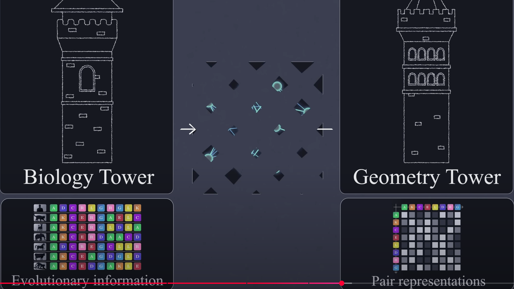
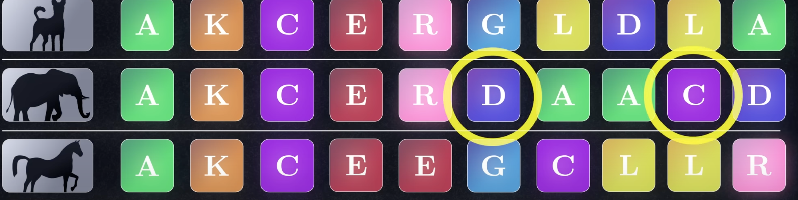

## Log
### 20250406
- まずはRibonanza RMA Foldingを理解したい
    - データセット
        - 主な学習データは `train_data.csv` に収められており、821,840 件のRNA配列と、それに対応する化学反応性（reactivity）の測定値が含まれています。
        - 測定は2つの実験手法「2A3_MaP」と「DMS_MaP」により行われ、各サンプルについて複数の反応性値（`reactivity_0001` から `reactivity_0206`）が与えられています。
        - 最初の26ヌクレオチドと最後の21ヌクレオチド、さらに配列長が206未満の場合はパディング部分に対しては反応性がNaN（欠損値）となっています。
        - float32, .parquet形式で保存されている
            - parquetファイルとは、効率的なデータ保存取得が可能な列指向データファイル形式
    - evaluation
        - 評価は、ノイズの少ない`SN_filter = 1`となっているサンプルのみを対象
    - 注意点
        - train/public LB vs. private LB data　配列長の分布が違う
    <details>
    <summary>rna_starterまとめ</summary>

    ### データ
    -  RNA_Datasetクラス
        - Datasetクラスとは
           - キーからデータサンプルへのマッピングを表現する抽象クラス
           - データ取得・連結・拡張など、データセットとしての基本的な機能を担う
           - `__getitem__`は実装必須
        - 行っていること
           - シーケンスの離散化(ACGUを0~3へ) する`seq_map`
           - `df['L']`にそれぞれのRNA配列長
           - などなど。
        - 保持してるデータ
           - RNAシーケンス配列長（L）
           - 各手法ごとの反応性値（reactivity）
           - 反応性誤差（react_err）
           - 信号対雑音比（sn）
        - `__getitem__`で行っていること
           - mask(True が実際の塩基、False がパディング)の作成
             - 実際の長さに対して、max長さに足りない分をパディングしておく
           - 各シーケンスを値に変換、最大長(Lmax=206)に合わせてパディング
        - LenMatchBatchSamplerクラス
           - 簡潔に：バッチサンプリング時に、同程度の長さのサンプルを同じバッチにまとめるために、BatchSamplerをラップしたもの
           - 主な処理
             - 配列長に基づいて、サンプルを異なる「バケット」に分類
             - サンプルの実際の長さ(maskのTrueの数)を16で割った数を利用して、**大体同じ長さのサンプルを同じバケットに**入れる
    ### モデル
   - RNAの化学反応性予測タスクでは、RNAの二次構造が反応性に大きく影響するため、長い依存関係（long dependencies）を捉えることが重要です。

        トランスフォーマーモデルは、自己注意機構（Self-Attention）を利用して系列全体の依存関係を効果的に捉えるため、RNAのような長い相関関係があるシーケンスに適しています。

        このノートブックでは、シンプルなSサイズのトランスフォーマーモデルを例示として示しています。
   - SinusoidalPosEmbクラス
     - 　役割：[位置エンコーディング](https://cvml-expertguide.net/terms/dl/seq2seq-translation/transformer/positional-encoding/)
       - シーケンス中の各要素が持つ位置情報を、連続値（sin, cos）を用いて埋め込み（エンコード）ます。これにより、モデルは単語や塩基の順序情報を認識できるようになります。
       - 単語埋め込みベクトル = (単語)分散表現
       - 位置情報を**入力に**加えて、モデルの一部のパラメータとする。sin/cosであれば固定パラメータだし、学習可能な場合もある。
       - [figわかりやすい](https://qiita.com/snsk871/items/93aba7ad74cace4abc62)
   - RNA_Model
     - 入力：RNA配列　出力：各位置の化学反応性
     - 構成要素：Embedding層 → 位置エンコーディング → Transformer Encoder → 出力層(nn.Linear)
     - Embedding
       - `__getitem__`にて、塩基→数値変換されたseqができてる。それを192次元ベクトルにembedding
       - nn.Embeddingは、数値インデックス→埋め込みベクトル　にする層
       - embeddingの利点：one-hotと違い、学習可能な意味を持ったベクトルとなる
     - Transformer Encoder
       - self attentionでシーケンス全体の相関関係（長い依存関係）を捉える
     - 出力層
       - Transformer Encoderの出力を線形層により次元削減し、最終的に2次元の出力（各位置について2つの値、ここでは2種類(2つの実験手法「2A3_MaP」と「DMS_MaP」)の化学反応性の予測値）を生成
     - forwardメソッドの流れ
       - マスクと長さの調整
       - 位置エンコーディング
       - Transformer Encoderの適用
         - `src_key_padding_mask`により、パディング部分を無視して処理
       - 最終出力
    ### Loss & Metric(評価指標)
    - Loss: モデルの出力とターゲットとなる反応性データとの間のL1 loss(MAE) ←
      - 詳細
      - `target['mask'][:,:pred.shape[1]]`で、予測テンソルと同じシーケンス長に合わせたマスクを取得→予測値`pred`から実際の値に対応する部分を抽出
      - `target['react'][target['mask']]`・`clip(0,1)`で値を制限→反応性の実データから有効な部分を抽出
    - メトリック：[このコンペが要求する](www.kaggle.com/competitions/stanford-ribonanza-rna-folding/overview/evaluation)メトリックに合わせて作成された、カスタムクラス
      - モデル評価時に、**全サンプルの誤差を一括して**計算。バッチごとの平均にしないことで、コンペの計測方法との整合性を保っている。
    ### Training
    - ポイント
      - DeviceDataLoader, FastAIのLearnerを使うことで、GPU利用や混合精度学習を自動化
    -  fastai
       - [初心者向け解説](https://qiita.com/lilacs/items/abac45188daf8277489a)
       - 転移学習も超簡単に書けちゃう
    ```python
    # 乱数シードの固定（再現性確保）
    seed_everything(SEED)

    # 出力先ディレクトリが存在しない場合は作成
    os.makedirs(OUT, exist_ok=True)

    # 事前に保存しておいた学習データ（Parquet形式）の読み込み
    df = pd.read_parquet(os.path.join(PATH,'train_data.parquet'))

    # fold数ループ（KFold CV）。Kaggleでは複数foldを一度に回すとメモリ不足(OOM)の可能性があるため、1つのみ実行
    for fold in [0]:

        # ============================
        # トレーニング用データセットの構築
        # ============================

        # 実際のトレーニングデータ（入力・出力含む）
        ds_train = RNA_Dataset(df, mode='train', fold=fold, nfolds=nfolds)

        # 長さマスクのみ取得（バッチを組む際の長さマッチングに使用）
        ds_train_len = RNA_Dataset(df, mode='train', fold=fold, nfolds=nfolds, mask_only=True)

        # ランダムにサンプルを抽出するサンプラー
        sampler_train = torch.utils.data.RandomSampler(ds_train_len)

        # シーケンス長が近いもの同士でバッチ化（効率化のため）
        len_sampler_train = LenMatchBatchSampler(sampler_train, batch_size=bs, drop_last=True)

        # トレーニング用DataLoaderをGPUデバイスに対応させたラッパー
        dl_train = DeviceDataLoader(
            torch.utils.data.DataLoader(ds_train, batch_sampler=len_sampler_train,
                                        num_workers=num_workers, persistent_workers=True),
            device
        )

        # ============================
        # 検証用データセットの構築
        # ============================

        ds_val = RNA_Dataset(df, mode='eval', fold=fold, nfolds=nfolds)
        ds_val_len = RNA_Dataset(df, mode='eval', fold=fold, nfolds=nfolds, mask_only=True)

        # 順番通りにサンプルを取り出すサンプラー（評価ではシャッフル不要）
        sampler_val = torch.utils.data.SequentialSampler(ds_val_len)

        # 検証用：長さマッチングバッチサンプラー（ドロップしない）
        len_sampler_val = LenMatchBatchSampler(sampler_val, batch_size=bs, drop_last=False)

        # 検証用DataLoader（GPU対応）
        dl_val = DeviceDataLoader(
            torch.utils.data.DataLoader(ds_val, batch_sampler=len_sampler_val,
                                        num_workers=num_workers),
            device
        )

        # Pythonのガベージコレクタを明示的に呼び出し、メモリを解放
        gc.collect()

        # ============================
        # モデル学習のセットアップ
        # ============================

        # FastAI 用の DataLoaders（トレーニング＋検証）を構築
        data = DataLoaders(dl_train, dl_val)

        # モデルのインスタンスを生成し、GPUに移動
        model = RNA_Model()
        model = model.to(device)

        # FastAI Learner のセットアップ（損失関数、コールバック、メトリクスを指定）
        learn = Learner(
            data,
            model,
            loss_func=loss,
            cbs=[GradientClip(3.0)],  # 勾配爆発を抑えるために勾配をクリップ
            metrics=[MAE()]
        ).to_fp16()  # 混合精度（fp16）学習を有効化（P100では効果薄だが、現代GPUでは高速化）

        # ============================
        # モデルの学習と保存
        # ============================

        # One Cycle Policy を使って32エポック学習
        learn.fit_one_cycle(
            32,
            lr_max=5e-4,   # 学習率の最大値
            wd=0.05,       # Weight Decay（正則化項）
            pct_start=0.02 # 最初の2%で急速に学習率を上げ、その後緩やかに下げる
        )

        # 学習済みモデルの重みを保存
        torch.save(learn.model.state_dict(), os.path.join(OUT, f'{fname}_{fold}.pth'))

        # メモリ解放
        gc.collect()
    ```
    </details>

- 転移学習とファインチューニングの違い
  - [実装コードイメージ](https://zenn.dev/acntechjp/articles/be5bc8fbccafe2)
    

### 20250407
 - 気づいたこと
   - 前回コンペも、大目的は「RNAの3D構造予測」だったっぽい(前回コンペも主催してるSHUJUNの[ディスカッション](https://www.kaggle.com/competitions/stanford-ribonanza-rna-folding/discussion/451853)参照)。
   - ↑のディスカッションの[コメント](https://www.kaggle.com/competitions/stanford-ribonanza-rna-folding/discussion/451853#2505758)に、当時存在した3D構造を出力するモデルが何個か乗ってる。これらは、Alphafoldの先例に従ってるから、進化的相同性(Multiple Sequence Alignments, MSA)があることを前提としているが、Ribonanza分子の大部分には無いらしい。

今日は(いつか)[Ribonanza 上位解法](https://zenn.dev/nishimoto/articles/14da0f491c7632)を読み進めていきたい

### 20250415
今回コンペのdiscussionを読み進めていく。
first submitもした！
- [ホストのwelcome](https://www.kaggle.com/competitions/stanford-rna-3d-folding/discussion/565064)のコメントから知ったこと
  - `*_sequences.csv`, `*_labels.csv`の違い
    - `*_sequences.csv` には、RNA構造の折り畳まれていないヌクレオチド配列（A、C、G、U）が含まれる
    - `*_labels.csv` には、配列中の全てのヌクレオチドのC1'原子のx、y、z座標を提供することで、折り畳まれたRNAの実際の構造が含まれている
    - つまり、前者はモデルの入力であり、後者は出力、つまり折り畳まれたRNAの構造です。
  - x1~x5の意味
    - 5つの異なるモデルによる予測を出力できる。
    - [このnb](https://www.kaggle.com/code/shujun717/ribonanzanet-3d-inference)では、1~4はtrainモードでDropoutのランダム性を活かしてランダムな4つの結果を出力・5つ目はevalモードで(確率的に変化しない)ガチ推論を行う
    ```python
    # モデルを評価モードに設定（DropoutやBatchNormが推論モードに切り替わる）
    model.eval()

    # 全予測結果を保存するリスト
    preds = []

    # テストデータセットの各サンプルに対してループ
    for i in range(len(test_dataset)):
        # 1つのテストサンプルの 'sequence' を取り出し、long型に変換
        src = test_dataset[i]['sequence'].long()

        # バッチ次元を追加（モデルの入力が [batch_size, ...] の形式を想定しているため）
        src = src.unsqueeze(0).cuda()  # GPU に転送

        # 以下では、Dropoutのランダム性を活かした予測を行うため、あえて訓練モードに切り替え
        model.train()

        # このサンプルに対する複数回の予測結果を保存するリスト
        tmp = []

        # Dropout の効果を得るため、モデルを train() にした状態で4回予測を行う
        for i in range(4):
            with torch.no_grad():  # 勾配を計算しない（推論モード）
                xyz = model(src).squeeze()  # 出力をバッチ次元除去して取得
            tmp.append(xyz.cpu().numpy())  # CPU に移して numpy 配列として保存

        # 通常の評価モードに戻して、もう1回予測（安定した出力）
        model.eval()
        with torch.no_grad():
            xyz = model(src).squeeze()
        tmp.append(xyz.cpu().numpy())

        # 5回分の予測（Dropout有×4 + Dropout無×1）をスタック → shape: (5, ..., ...)
        tmp = np.stack(tmp, 0)

        # すべての予測を保存
        preds.append(tmp)
    ```

- [過去コンペで重要な考え・上位解法のリンクまとめ](https://www.kaggle.com/competitions/stanford-rna-3d-folding/discussion/565292)
- [AF2までの経緯を説明した動画](https://www.youtube.com/watch?v=P_fHJIYENdI)
  - AFの入力：タンパク質配列・evolutionary table。co-evolutionが重要
    - co-evolutionの定義：あるアミノ酸残基が変異したときに、それに対応して別の残基も変異するような関係性。
      - これは、立体構造内で互いに接触しているようなペアでよく見られる。
    - MSAの定義：複数の相同性のある配列（＝進化的に関連のある配列）を並べて比較し、どこが保存され、どこが変異しているかを調べる手法。
      - つまり、MSAが入力、co-evolutionがMSAより導かれる特徴量
    - Ribonanzaでは「この2つの残基は一緒に変わる ⇒ 近くにあるかも」みたいな組があまりなく、AF的な手法が効かない　ということか。
  - AFの出力：直接3D構造ではなく、構造の距離を表した2次元ペア行列。
    - 距離だけでなく、アミノ酸残基がねじれているか
  - AF2の強み(1) EVO Former
    
    - AF1
      - 左の情報を入力にDNNし、右を出力
    - AF2
      - 入力配列から左・右をそれぞれ予測。その後ブリッジして互いに補完。
      - 例　左から右
        
        - アミノ配列の変異が同時に怒っている→構造に重要→右へ補完
        - triangular attentionがアミノ酸残基同士の距離の情報を与える→pair representationが更新される
      - 例　右から左
        - pair representationsで、2つの残基が近すぎる→その組み合わせは行わないように左に伝える
      - この情報の行き来を48回行う
  - AF2の強み (2) Stucture Module
  - [日本語でAF2までの流れ・Structure Moduleなどの詳細が書かれている](https://www.jstage.jst.go.jp/article/jsbibr/3/2/3_jsbibr.2022.3/_html/-char/ja)

## 読みたい
- [ ] [Ribonanza 日本人の解法](https://qiita.com/SHIBA_TT/items/e6f4fc974d026fab0ebd)
- [ ] [Ribonanza 上位解法](https://zenn.dev/nishimoto/articles/14da0f491c7632)

## tips
- markdown
  - [画像をクリップボードから直接.mdへ](https://qiita.com/P-man_Brown/items/31a0f1cc8d108b2d88f6)
    - Default Nameを変更することでディレクトリも変更可能
    - cmd opt v
  - [vscodeで書きやすく](https://note.com/teaslife/n/ncbe26acef401)
    - markdown all in one, markdown preview enhanced
